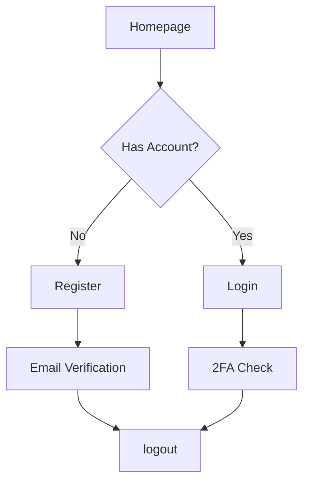
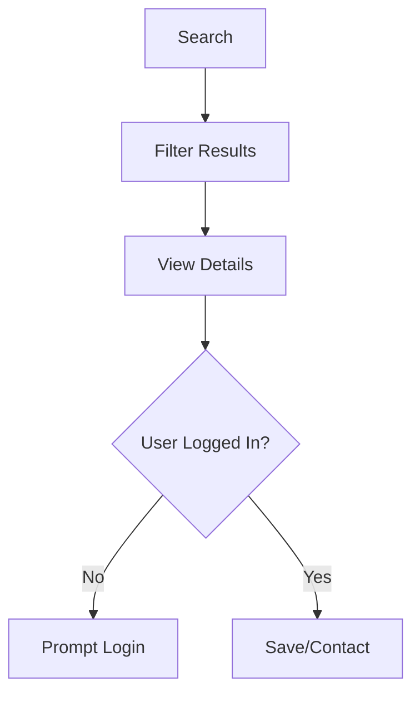
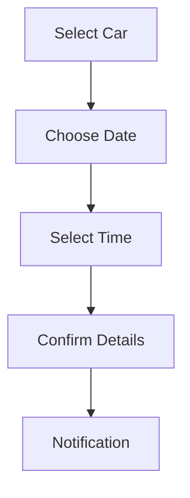

# Technical Implementation Flows

## Authentication Flow

## Car Listing Flow

## Meeting Scheduling Flow

## File Structure
- /public/
  - Frontend entry points
  - Static assets
- /src/
  - Business logic
  - Models
- /data/
  - JSON storage
- /logs/
  - System logs
